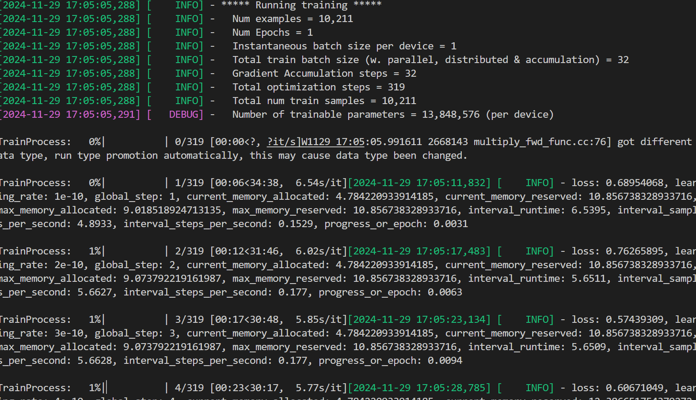

# Qwen2-VL

## 1. 模型介绍

[Qwen2-VL](https://qwenlm.github.io/blog/qwen2-vl/) 是 Qwen 团队推出的一个专注于视觉与语言（Vision-Language, VL）任务的多模态大模型。它旨在通过结合图像和文本信息，提供强大的跨模态理解能力，可以处理涉及图像描述、视觉问答（VQA）、图文检索等多种任务。Qwen2-VL通过引入创新性的技术如 Naive Dynamic Resolution 和 M-RoPE，以及深入探讨大型多模态模型的潜力，显著地提高了多模态内容的视觉理解能力。


**本仓库支持的模型权重:**

| Model              |
|--------------------|
| Qwen/Qwen2-VL-2B-Instruct  |
| Qwen/Qwen2-VL-7B-Instruct  |
| Qwen/Qwen2-VL-72B-Instruct  |
| Qwen/Qwen2-VL-2B  |
| Qwen/Qwen2-VL-7B  |
| Qwen/Qwen2-VL-72B  |

注意：与huggingface权重同名，但权重为paddle框架的Tensor，使用`xxx.from_pretrained("Qwen/Qwen2-VL-2B-Instruct")`即可自动下载该权重文件夹到缓存目录。


## 2 环境准备
- **python >= 3.10**
- **paddlepaddle-gpu 要求是develop版本**
```
# 安装示例
python -m pip install paddlepaddle-gpu==0.0.0.post118 -f https://www.paddlepaddle.org.cn/whl/linux/gpu/develop.html
```

- **paddlenlp == 3.0.0b3**
```
# 安装示例
python -m pip install paddlenlp==3.0.0b3
```

> 注：
* 请确保安装了以上依赖，否则无法运行。同时，需要安装 paddlemix/external_ops 下的自定义OP, `python setup.py install`。如果安装后仍然找不到算子，需要额外设置PYTHONPATH
* (默认开启flash_attn)使用flash_attn 要求A100/A800显卡或者H20显卡


## 3 推理预测

### a. 单图预测
```bash
python paddlemix/examples/qwen2_vl/single_image_infer.py
```

### b. 多图预测
```bash
python paddlemix/examples/qwen2_vl/multi_image_infer.py
```

### c. 视频预测
```bash
python paddlemix/examples/qwen2_vl/video_infer.py
```

## 4 模型微调

### 4.1 微调数据准备

SFT数据集选择6个公开的数据集，包括`dvqa`、`chartqa`、`ai2d`、`docvqa`、`geoqa+`、`synthdog_en`，详见`paddlemix/examples/qwen2_vl/configs/baseline_6data_330k.json`

PaddleMIX团队整理后的下载链接为：
```
wget https://paddlenlp.bj.bcebos.com/datasets/paddlemix/playground.tar # 50G
wget https://paddlenlp.bj.bcebos.com/datasets/paddlemix/playground/opensource_json.tar
```
opensource_json.tar需下载解压在playground/目录下，opensource_json 里是数据标注的json格式文件。

### 4.2 微调命令

注意：此微调训练为语言模型微调，冻结视觉编码器而放开LLM训练，2B模型全量微调训练的显存大小约为30G，7B模型全量微调训练的显存大小约为75G。

```bash
# 2B
sh paddlemix/examples/qwen2_vl/shell/basline_2b_bs32_1e8.sh

# 2B lora
sh paddlemix/examples/qwen2_vl/shell/basline_2b_lora_bs32_1e8.sh

# 7B
sh paddlemix/examples/qwen2_vl/shell/basline_7b_bs32_1e8.sh

# 7B lora
sh paddlemix/examples/qwen2_vl/shell/basline_7b_lora_bs32_1e8.sh
```

注意：微调2b模型的运行示例如下：



### 4.3 微调后使用

同按步骤3中的模型推理预测，只需将`paddlemix/examples/qwen2_vl/single_image_infer.py`中的`--model_path`参数修改为微调后的模型路径即可。

```bash
python paddlemix/examples/qwen2_vl/single_image_infer.py
```


## 参考文献
```BibTeX
@article{Qwen2-VL,
  title={Qwen2-VL},
  author={Qwen team},
  year={2024}
}
```
