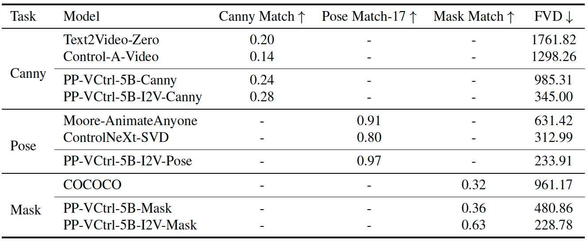
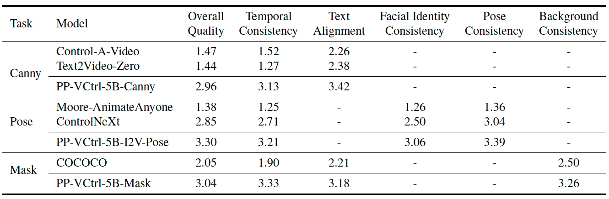

English | [简体中文](README_CN.md)
# PP-VCtrl
**PP-VCtrl** is a controllable video generation model that uses an auxiliary condition encoder to transform a text-to-video generation model into a custom video generator, without retraining of the original generator. 

The model employs a unified encoding process to convert various control inputs into standardized formats，along with sparse residual connections to efficiently integrate controllable information into the generator. Additionally, it applies task-specific masks to enhance adaptability. 

These design features make PP-VCtrl suitable for a wide range of video generation tasks, such as **character animation**, **scene transitions**, and **video editing**.


## 📰 News

`[2025-01-09]`:🎉 Release PP-Vctrl inference code and PP-Vctrl-5B-v1 model weights. 

`[2025-01-08]`:🎉 Release PP-Vctrl: a plug-and-play module turning  text-to-video models into custom video generators. 


## 🚩 **TODO**
- [x] Inference code 
- [x] PP-VCtrl v1 model weights 
- [ ] PP-VCtrl v2 model weights 

## 📷 Quick Demos
### Wonderful Demos Generated by PP-VCtrl-I2V 
First, extract the video control sequences (edges, masks, and poses) from the source video. Then, use ControlNet to regenerate the first frame of the video. Input the video control sequences and the newly generated first frame into PP-VCtrl-I2V to generate the new video.

### 1. PP-VCtrl-I2V-Canny
| Input Video               | Control Video               | Reference       Image             | Output   Video             |
|---------------------------|-----------------------------|-----------------------|--------------------------|
| </img>|| </img>|
| </img>|| </img>|


### 2. PP-VCtrl-I2V-Mask
| Input Video               | Control Video               | Reference      Image      | Output  Video             |
|---------------------------|-----------------------------|---------------------------|---------------------------|
| </img>|| </img>|
| </img>|| </img>|

### 3.PP-VCtrl-I2V-Pose
| Input Video               | Control Video               | Reference      Image      | Output  Video             |
|----------------------|-----------------------|----------------------|-----------------------|
| </img>|| </img>|
| </img>|| </img>|


## 🚀 Quick Start
***Note:*** 
PP-VCtrl works on **PaddlePaddle** and **ppdiffusers**.Usage and operation instructions are as follows.

### 1. Setup repository and environment

```bash
#create python environment
conda create -n ppvctrl python=3.10 -y
source $(conda info --base)/etc/profile.d/conda.sh
conda activate ppvctrl
```

```bash
# Install version 3.0.0-beta-2 of paddlepaddle-gpu. We have chosen the CUDA 11.8 version, but you can visit https://www.paddlepaddle.org.cn/ to find the version that suits you.
python -m pip install paddlepaddle-gpu==3.0.0b2 -i https://www.paddlepaddle.org.cn/packages/stable/cu118/
```

```bash
# Clone PaddleMIX
git clone https://github.com/PaddlePaddle/PaddleMIX.git
```

```bash
cd PaddleMIX
# Install paddlemix
pip install -e .
# Install ppdiffusers
pip install -e ppdiffusers
# Install paddlenlp
pip install paddlenlp==v3.0.0-beta2
# vctrl folder
cd ppdiffusers/examples/vctrl
# Install other required dependencies.
pip install -r requirements.txt
# Install paddlex
pip install paddlex==3.0.0b2
```

### 2. Download the PP-VCtrl weights
Please download the weights as follows:

#### 2.1. Download PP-VCtrl-Canny Weights

```bash
#create vctrl-canny folder
mkdir -p weights/canny

# download v1 weights
wget -P weights/canny https://bj.bcebos.com/v1/dataset/PaddleMIX/vctrl/paddle_weights/vctrl_canny_5b_i2v_vctrl-tiny.pdparams
wget -P weights/canny https://bj.bcebos.com/v1/dataset/PaddleMIX/vctrl/paddle_weights/vctrl_canny_5b_t2v.pdparams


```

#### 2.2. Download PP-VCtrl-Mask Weights
```bash
#create vctrl-mask folder
mkdir -p weights/mask

#download v1 weights
wget -P weights/mask https://bj.bcebos.com/v1/dataset/PaddleMIX/vctrl/paddle_weights/vctrl_5b_i2v_mask.pdparams
wget -P weights/mask https://bj.bcebos.com/v1/dataset/PaddleMIX/vctrl/paddle_weights/vctrl_5b_t2v_mask.pdparams


```
#### 2.3. Download PP-VCtrl-Pose Weights
```bash
#create vctrl-poses folder
mkdir -p weights/poses

#download v1 weights
wget -P weights/poses https://bj.bcebos.com/v1/dataset/PaddleMIX/vctrl/paddle_weights/vctrl_pose_5b_i2v.pdparams
```

### 3. Prepare test data
We have provided you with the required test cases.

#### 3.1. Upload the test data
You can also upload your prepared videos and the corresponding text to the **/examples** directory as shown below:

```
examples/
├── canny/case-1
│   ├── pixels_values.mp4
│   ├── prompt.txt
├── mask/case-1
│   ├── pixels_values.mp4
│   ├── prompt.txt
├── pose/case-1
│   ├── pixels_values.mp4
│   ├── prompt.txt
```
**Note**: First, you should select the appropriate task type, and then upload your videos and texts to either **/examples/pose**, **/examples/mask**, or **/examples/canny**. Our Mask and Canny models currently only support videos with a resolution of **720x480**. The Pose model supports both **720x480** and **480x720** video resolutions.

#### 3.2. Extract control conditions

We provide a control condition extraction script to help you obtain the control conditions required for video generation. You can execute the script below based on the task you have chosen to retrieve the relevant control conditions.

##### 3.2.1. Extract Canny Map

```bash
#canny
bash anchor/extract_canny.sh
```

##### 3.2.2. Extract Mask Map

```bash
#download sam2
mkdir -p anchor/checkpoints/mask
wget -P anchor/checkpoints/mask https://bj.bcebos.com/v1/paddlenlp/models/community/Sam/Sam2/sam2.1_hiera_large.pdparams
#mask
bash anchor/extract_mask.sh
```
**Note**: You can choose the video subject you need to edit by modifying the **prompt** in the **anchor/extract_mask.sh** file.

##### 3.2.2. Extract Human Pose Map

```bash
#download detection weights
wget -P anchor/checkpoints/paddle3.0_hrnet_w48_coco_wholebody_384x288 https://bj.bcebos.com/v1/dataset/PaddleMIX/xiaobin/pose_checkpoint/paddle3.0_hrnet_w48_coco_wholebody_384x288/model.pdiparams
wget -P anchor/checkpoints/PP-YOLOE_plus-S_infer https://bj.bcebos.com/v1/dataset/PaddleMIX/xiaobin/pose_checkpoint/PP-YOLOE_plus-S_infer/inference.pdiparams

#pose
bash anchor/extract_pose.sh
```

#### 3.3. Extract Results
After extracting the control conditions, you will obtain **guide_values.mp4** and **reference_image.jpg** in the corresponding test case directory. The mask task will generate an additional **mask_values.mp4**, as shown below:

```
examples/
├── canny/case-1
│   ├── guide_values.mp4
│   ├── pixels_values.mp4
│   ├── prompt.txt
│   └── reference_image.jpg
├── mask/case-1
│   ├── guide_values.mp4
|   ├── mask_values.mp4
│   ├── pixels_values.mp4
│   ├── prompt.txt
│   └── reference_image.jpg
├── pose/case-1
│   ├── guide_values.mp4
│   ├── pixels_values.mp4
│   ├── prompt.txt
│   └── reference_image.jpg
```

## 🔥 Inference and Generation

The final inference results of the model can be found in the **/infer_outputs** directory.

### 1. Generate with Canny Map
```bash
##i2v
bash scripts/infer_cogvideox_i2v_canny_vctrl.sh

##t2v
bash scripts/infer_cogvideox_t2v_canny_vctrl.sh
```

### 2. Generate with Mask Map
```bash
##i2v
bash scripts/infer_cogvideox_i2v_mask_vctrl.sh

##t2v
bash scripts/infer_cogvideox_t2v_mask_vctrl.sh
```
**Note**: The edge and mask control models can support both t2v (text-to-video) and i2v (image-to-video) models simultaneously.

### 3. Generate with Human Pose Map

```bash
##i2v
bash scripts/infer_cogvideox_i2v_pose_vctrl.sh
```

**Note**: The pose control models only for i2v (image-to-video) models .

### 4. Gradio

We have also created a Gradio application for you to interact with our model.

**Generate with Canny Map:** https://aistudio.baidu.com/application/detail/63852

**Generate with Mask Map:** https://aistudio.baidu.com/application/detail/63854

#### 4.1. Gradio Environment Setup 
```bash
mkdir -p weights/sam2/
wget -P weights/sam2/ https://bj.bcebos.com/v1/paddlenlp/models/community/Sam/Sam2/sam2.1_hiera_large.pdparams
```
##### 4.1.1. canny on gradio
```bash
python gradios/gradio_canny2video.py
```
##### 4.1.2. mask on gradio
```bash
python gradios/gradio_mask2video.py
```

## 📚 Technical Details

### 1. PP-VCtrl
In the digital creative industry, video generation has become a key tool for content creation and storytelling. While text-to-video diffusion models have enabled language-driven video generation, controlling fine spatiotemporal features remains a major challenge. In scenarios like advertising, film post-production, live-streaming sales, and virtual character interactions, text input alone cannot precisely specify visual features such as object outlines, human poses, or scene backgrounds, requiring more accurate control signals. The current trial-and-error approach of adjusting text descriptions is inefficient and cannot fully meet the need for precise control.

Although ControlNet has made breakthroughs in controllable image generation, there is no universal control solution for video generation. Existing research focuses on task-specific solutions, leading to fragmentation and limiting flexibility across tasks. Some methods try to control video by adjusting image generation models, which affects temporal consistency and overall quality.

To solve these issues, we propose PP-VCtrl, a unified framework that uses auxiliary condition encoders to provide flexible, precise control of various signals while maintaining efficient performance. It is well-suited for tasks requiring precise control, such as character animation, scene transitions, and video editing.

### 2. Data Strategy

Compared to text/image-to-video generation, controllable video generation requires data that not only meets visual quality and text-video alignment but also needs to be constructed according to different controllable tasks. We build an original dataset pool by collecting publicly available video datasets. After splitting the raw data into single shots, removing black edges, watermarks, and subtitles, we filter the data based on aesthetic quality scores to obtain a usable data pool. Using the usable data pool, we perform recaption, human keypoint extraction, and video segmentation to meet the data requirements for Canny, Pose, and Mask video editing tasks. The process is as shown in the diagram below:

Through the above process, we obtained the training data distribution for controllable video generation across different tasks:


### 3. Training Strategy
To enhance the model's generalization ability and robustness, we adopted diverse data augmentation and training strategies. During the denoising process, we sample time steps using a sine function to better focus on key stages of video generation. In the spatial dimension, we use a default cropping strategy based on a normal distribution, adapting the crop according to the video's aspect ratio. This approach increases data diversity while ensuring that the model effectively focuses on the main content of the video.

We also designed specific optimization strategies for different tasks. For edge control tasks, we use dynamic threshold sampling to increase data diversity. For human pose control tasks, we employ separate padding and cropping preprocessing strategies for landscape and portrait videos. In mask control tasks, we apply a multi-target sampling method based on area-weighted probability distributions, dynamically selecting target areas and supporting region expansion and multi-target joint control. Additionally, random probability-based dilation is used to improve the model's robustness and make the generated results more natural.

These strategies are integrated into the unified video generation control framework, significantly improving the model's adaptability and generation quality across various scenarios, while fully leveraging the advantages of the PP-VCtrl universal control framework.

### 4. Quantitative Metrics
In the quantitative evaluation of edge control video generation (Canny), human pose control video generation (Pose), and mask control video generation (Mask) tasks, the PPVCtrl model excels or surpasses existing open-source task-specific methods in both control ability and video quality metrics.


We conducted manual evaluation experiments, inviting multiple evaluators to score videos generated by different methods. The evaluation dimensions included overall video quality, temporal consistency, and more. The results showed that PPVCtrl outperformed existing open-source methods in all evaluation dimensions.


<!-- 
## More version
<details close>
<summary>Model Versions</summary>
</details>
-->
<!-- 
## Contact us
Users: [Users@example.com](Users@example.com)  
-->
<!-- 
 ## BibTex

```
@article{guo2023animatediff,
  title={AnimateDiff: Animate Your Personalized Text-to-Image Diffusion Models without Specific Tuning},
  author={Guo, Yuwei and Yang, Ceyuan and Rao, Anyi and Liang, Zhengyang and Wang, Yaohui and Qiao, Yu and Agrawala, Maneesh and Lin, Dahua and Dai, Bo},
  journal={International Conference on Learning Representations},
  year={2025}
}

```上面的代码打印了一条消息 -->