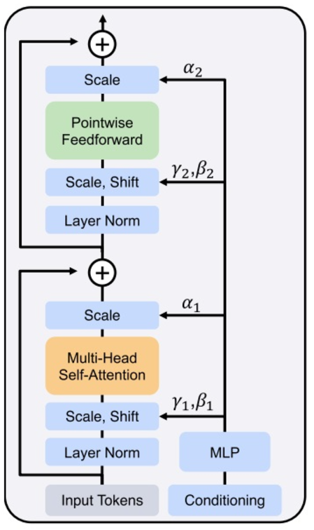

本文档详细介绍了 Stable Diffusion 3（SD3）模型的核心架构——MM-DiT多模态变换器，以及在 SD3模型在PaddleMix框架中的使用指南。

**Stable Diffusion 3 引入了一种基于 Rectified Flow（修正流）的创新型高分辨率图像生成方法，显著提升了扩散模型的生成性能。**该研究通过优化时间步长采样策略，强调中间时间步的采样权重，从而增强了修正流模型在少步采样场景下的表现。其核心架构 MM-DiT 多模态变换器采用独立的文本和图像模态权重设计，支持模态内外双向信息交互，并结合多层注意力机制和多模态特征融合，以进一步强化对文本的理解能力和图像生成效果。


# **1.MM-DiT多模态变换器**

SD3 的去噪模型是一个**Diffusion Transformer (DiT)**。如果去噪模型只有带噪图像这一种输入的话，DiT 则会是一个结构非常简单的模型，和标准 ViT 一样：图像过图块化层 (Patching) 并与位置编码相加，得到序列化的数据。这些数据会像标准 Transformer 一样，经过若干个子模块，再过反图块层得到模型输出。DiT 的每个子模块 DiT-Block 和标准 Transformer 块一样，由 LayerNorm, Self-Attention, 一对一线性层 (Pointwise Feedforward, FF) 等模块构成


在扩散模型中，去噪网络必须能够支持带有约束的生成，因为在去噪过程中，模型需要遵循特定的时刻约束。此外，作为文本生成图像的模型，SD3 也需要支持文本约束。DiT和本文提出的MM-DiT都将模型设计的重点放在了处理这些额外约束的能力上。

SD3 的模块保留了 DiT 的设计，用自适应 LayerNorm (Adaptive LayerNorm, AdaLN) 来引入额外约束。具体来说，过了 LayerNorm 后，数据的均值、方差会根据时刻约束做调整。另外，过完 Attention 层或 FF 层后，数据也会乘上一个和约束相关的系数。




文本约束以两种方式输入进模型：与时刻编码拼接、在注意力层中融合。具体数据关联细节可参见下图。如图所示，为了提高 SD3 的文本理解能力，描述文本 (“Caption”) 经由三种编码器编码，得到两组数据。一组较短的数据会经由 MLP 与文本编码加到一起；另一组数据会经过线性层，输入进 Transformer 的主模块中。


**MM-DiT（Multimodal Diffusion Transformer）**是本文提出的一种新型多模态变换器架构，专为文本到图像生成任务设计。它改进了传统扩散模型的架构，通过更高效地建模文本和图像模态之间的关系，显著提升了生成质量。以下是对**MM-DiT架构**的详细解析：


### **1.1核心设计理念**

- **独立模态权重：**MM-DiT为文本和图像模态分别设计了独立的权重集合，从而避免共享权重可能带来的模态特异性信息损失。这种设计允许每个模态在其特定特征空间中进行独立建模。
- **双向信息交互：**模型通过将文本和图像模态的特征序列输入统一的注意力机制，允许两种模态之间进行双向信息流动。这种交互提升了文本理解和跨模态对齐能力。
- **可扩展性：**MM-DiT在模型深度和参数规模增加时，表现出较好的扩展能力，能够有效利用更大的计算资源以提升生成质量。


### **1.2 模型架构组成**

#### （1）输入编码
- **图像编码**：  
  使用预训练的自动编码器将输入图像编码到一个低维的潜在空间（latent space）。具体而言，将原始RGB图像。其中 是潜在空间的通道维度。图像特征随后被分割成小块并嵌入为特征序列。

- **文本编码**：  
  使用预训练的文本模型（CLIP、T5）对文本进行编码，生成句子级（pooled）和序列级（contextual）嵌入。这些嵌入被进一步投影到与图像特征相同的维度，以便进行后续融合。

#### （2）模态内处理
- **分离的模态权重**：  
  图像和文本模态分别由独立的注意力块和 MLP 层处理，确保每种模态在其特定空间内进行专门建模。这种分离减少了模态间不必要的干扰，同时允许不同模态在融合前充分提取自身特征。

#### （3）模态间交互
- **注意力机制**：  
  文本和图像的特征序列在交互阶段通过统一的多头自注意力机制进行融合。在注意力计算中，两个模态的特征序列被拼接在一起，使得注意力机制能够捕获跨模态的全局依赖关系。

- **位置编码**：  
  使用位置编码为图像特征添加空间位置信息，为文本特征添加序列位置信息，确保注意力机制能够正确捕获空间和序列结构。

#### （4）输出生成
- 模态交互后，特征序列通过解码器重建到潜在空间，随后使用预训练的解码器将其映射回高分辨率的图像空间。

### **1.3. 关键创新点**

#### （1）两种模态的独立权重
MM-DiT将每个模态的特征编码和处理任务分离到独立的权重集合上，使模型能够分别优化文本和图像的特定特征。这种设计本质上等同于对每个模态单独训练一个变换器，同时通过注意力融合层实现模态间的信息流动。

#### （2）多模态融合机制
在模态融合阶段，模型将文本和图像特征序列拼接后输入多头注意力机制。通过这种机制，模型可以实现文本对图像生成的精确引导。例如，复杂的描述性文本可以直接通过注意力权重影响图像生成中的细节。

#### （3）深层结构扩展
MM-DiT使用多层堆叠的模态融合块，其深度 \( d \) 可以根据需求灵活调整。实验表明，增加深度和参数量（如8B参数模型）能显著提升生成质量。

### **1.4 实验验证**

#### （1）生成质量
使用 CC12M 等数据集进行训练，实验表明 MM-DiT 在生成质量（FID、CLIP 得分）上显著优于传统变换器架构（如 DiT、UViT）。其文本理解能力、图像细节处理能力及模态对齐性能均达到了领先水平。

#### （2）采样效率
MM-DiT 架构优化了修正流的直线路径采样流程，尤其在少步采样场景下（如 5 步、10 步）性能优异。

#### （3）模块化设计
MM-DiT 通过模块化设计实现了灵活性：
- 可自由选择使用不同的文本编码器（ T5 或 CLIP），根据场景需求调整模型的推理效率和性能。
- 支持高分辨率图像的生成，分辨率从 256×256 扩展到 1024×1024 时仍能保持稳定的生成性能。

## **2.环境配置**

首先，确保您的系统已安装PaddlePaddle框架。您可以通过以下命令安装PPDiffusers：

```

!pip install protobuf==5.28.3 --user
!pip install ppdiffusers
!pip install paddlenlp==v3.0.0-beta2
!pip install huggingface_hub==0.23.0

```

## **3.快速开始：生成您的第一幅图像**

安装完成后，您可以执行如下python文件生成一幅图像，内容如下：

```
import paddle
from ppdiffusers import StableDiffusion3Pipeline
pipe = StableDiffusion3Pipeline.from_pretrained(
    "stabilityai/stable-diffusion-3-medium-diffusers", paddle_dtype=paddle.float16
)
generator = paddle.Generator().manual_seed(42)
prompt = "A cat holding a sign that says hello world"
image = pipe(prompt, generator=generator).images[0]
image.save("text_to_image_generation-stable_diffusion_3-result.png")
```

```
!python text_to_image_generation-stable_diffusion_3.py
```

```
from PIL import Image
def show_image(image_path):
    img = Image.open(image_path)
    img.show()
show_image("text_to_image_generation-stable_diffusion_3-result.png")

```

详细内容请参考以下链接：

https://github.com/PaddlePaddle/PaddleMIX/blob/develop/ppdiffusers/examples/inference/text_to_image_generation-stable_diffusion_3.py

## **4.高性能推理**

PPDiffusers支持Stable Diffusion 3高性能推理，推理性能提升70%+。

### 环境准备

```shell
# 安装 triton并适配paddle
python -m pip install triton
python -m pip install git+https://github.com/zhoutianzi666/UseTritonInPaddle.git
python -c "import use_triton_in_paddle; use_triton_in_paddle.make_triton_compatible_with_paddle()"

# 安装develop版本的paddle，请根据自己的cuda版本选择对应的paddle版本，这里选择12.3的cuda版本
python -m pip install --pre paddlepaddle-gpu -i https://www.paddlepaddle.org.cn/packages/nightly/cu123/

# 安装paddlemix库,使用集成在paddlemix库中的自定义算子。
python -m pip install paddlemix

# 指定 libCutlassGemmEpilogue.so 的路径
# 详情请参考 https://github.com/PaddlePaddle/Paddle/blob/develop/paddle/phi/kernels/fusion/cutlass/gemm_epilogue/README.md
export LD_LIBRARY_PATH=/your_dir/Paddle/paddle/phi/kernels/fusion/cutlass/gemm_epilogue/build:$LD_LIBRARY_PATH
- 请注意，该项用于在静态图推理时利用Cutlass融合算子提升推理性能，但是并不是必须项。
如果不使用Cutlass可以将`./text_to_image_generation-stable_diffusion_3.py`中的`exp_enable_use_cutlass`设为False。
-
```

### 高性能推理指令：

```shell
# 执行FP16推理
python  text_to_image_generation-stable_diffusion_3.py  --dtype float16 --height 512 --width 512 \
--num-inference-steps 50 --inference_optimize 1  \
--benchmark 1
```
注：--inference_optimize 1 用于开启推理优化，--benchmark 1 用于开启性能测试。

详细内容请参考以下链接：

https://github.com/PaddlePaddle/PaddleMIX/tree/develop/ppdiffusers/deploy/sd3

## **5.Paddle Stable Diffusion 3 模型多卡推理：**

### Data Parallel 实现原理
- 在SD3中，对于输入是一个prompt时，使用CFG需要同时进行unconditional guide和text guide的生成，此时 MM-DiT-blocks 的输入batch_size=2；
所以我们考虑在多卡并行的方案中，将batch为2的输入拆分到两张卡上进行计算，这样单卡的计算量就减少为原来的一半，降低了单卡所承载的浮点计算量。
计算完成后，我们再把两张卡的计算结果聚合在一起，结果与单卡计算完全一致。

### Model parallel 实现原理
- 在SD3中,在Linear和Attnetion中有大量的GEMM（General Matrix Multiply），当生成高分辨率图像时，GEMM的计算量以及模型的预训练权重大小都呈线性递增。
因此，我们考虑在多卡并行方案中，将模型的这些GEMM拆分到两张卡上进行计算，这样单卡的计算量和权重大小就都减少为原来的一半，不仅降低了单卡所承载的浮点计算量，也降低了单卡的显存占用。

### 开启多卡推理方法
- Paddle Inference 提供了SD3模型的多卡推理功能，用户可以通过设置 `mp_size 2` 来开启Model Parallel，使用 `dp_size 2`来开启Data Parallel。
使用 `python -m paddle.distributed.launch --gpus “0,1,2,3”` 指定使用哪些卡进行推理，其中`--gpus “0,1,2,3”`即为启用的GPU卡号。
如果只需使用两卡推理，则只需指定两卡即可，如 `python -m paddle.distributed.launch --gpus “0,1”`。同时需要指定使用的并行方法及并行度，如 `mp_size 2` 或者 `dp_size 2`。

- 注意，这里的`mp_size`需要设定为不大于输入的batch_size个，且`mp_size`和`dp_size`的和不能超过机器总卡数。
- 高性能多卡推理指令：

```shell
# 执行多卡推理指令
python -m paddle.distributed.launch --gpus "0,1,2,3" text_to_image_generation-stable_diffusion_3.py \
--dtype float16 \
--height 1024 \
--width 1024 \
--num-inference-steps 20 \
--inference_optimize 1 \
--mp_size 2 \
--dp_size 2 \
--benchmark 1
```
注：--inference_optimize 1 用于开启推理优化，--benchmark 1 用于开启性能测试。

详细内容请参考以下链接：

https://github.com/PaddlePaddle/PaddleMIX/tree/develop/ppdiffusers/deploy/sd3

## **6.DreamBooth微调**

[DreamBooth: Fine Tuning Text-to-Image Diffusion Models for Subject-Driven Generation](https://arxiv.org/abs/2208.12242) 是一种用于个性化文本到图像模型的方法，只需要主题的少量图像（3~5张）即可。

`train_dreambooth_sd3.py` 脚本展示了如何进行DreamBooth全参数微调[Stable Diffusion 3](https://huggingface.co/papers/2403.03206)， `train_dreambooth_lora_sd3.py` 脚本中展示了如何进行DreamBooth LoRA微调。


> [!NOTE]  
> Stable Diffusion 3遵循 [Stability Community 开源协议](https://stability.ai/license)。
> Community License: Free for research, non-commercial, and commercial use for organisations or individuals with less than $1M annual revenue. You only need a paid Enterprise license if your yearly revenues exceed USD$1M and you use Stability AI models in commercial products or services. Read more: https://stability.ai/license


### 6.1 安装依赖

在运行脚本之前，请确保安装了库的训练依赖项：

```bash
pip install -r requirements_sd3.txt
```


### 示例
首先需要获取示例数据集。在这个示例中，我们将使用一些狗的图像：https://paddlenlp.bj.bcebos.com/models/community/westfish/develop-sdxl/dog.zip 。

解压数据集``unzip dog.zip``后，使用以下命令启动训练：

```bash
export MODEL_NAME="stabilityai/stable-diffusion-3-medium-diffusers"
export INSTANCE_DIR="dog"
export OUTPUT_DIR="trained-sd3"
wandb offline
```

```bash
python train_dreambooth_sd3.py \
  --pretrained_model_name_or_path=$MODEL_NAME  \
  --instance_data_dir=$INSTANCE_DIR \
  --output_dir=$OUTPUT_DIR \
  --mixed_precision="fp16" \
  --instance_prompt="a photo of sks dog" \
  --resolution=1024 \
  --train_batch_size=1 \
  --gradient_accumulation_steps=4 \
  --learning_rate=1e-4 \
  --report_to="wandb" \
  --lr_scheduler="constant" \
  --lr_warmup_steps=0 \
  --max_train_steps=50 \
  --validation_prompt="A photo of sks dog in a bucket" \
  --validation_epochs=25 \
  --seed="0" \
  --checkpointing_steps=250
```

fp16训练需要显存67000MiB，为了更好地跟踪我们的训练实验，我们在上面的命令中使用了以下标志：

* `report_to="wandb"` 将确保在 Weights and Biases 上跟踪训练运行。要使用它，请确保安装 `wandb`，使用 `pip install wandb`。
* `validation_prompt` 和 `validation_epochs` 允许脚本进行几次验证推理运行。这可以让我们定性地检查训练是否按预期进行。


### 6.2 推理
训练完成后，我们可以通过以下python脚本执行推理：
```python
from ppdiffusers import StableDiffusion3Pipeline
from ppdiffusers import (
    AutoencoderKL,
    StableDiffusion3Pipeline,
    SD3Transformer2DModel,
)
import paddle

transformer_path = "your-checkpoint/transformer"

pipe = StableDiffusion3Pipeline.from_pretrained(
    "stabilityai/stable-diffusion-3-medium-diffusers", paddle_dtype=paddle.float16
)
transformer = SD3Transformer2DModel.from_pretrained(transformer_path)

image = pipe("A picture of a sks dog in a bucket", num_inference_steps=25).images[0]
image.save("sks_dog_dreambooth_finetune.png")
```


## 6.3 LoRA + DreamBooth

[LoRA](https://huggingface.co/docs/peft/conceptual_guides/adapter#low-rank-adaptation-lora) 是一种流行的节省参数的微调技术，允许您以极少的可学习参数实现全微调的性能。

要使用 LoRA 进行 DreamBooth，运行：

```bash
export MODEL_NAME="stabilityai/stable-diffusion-3-medium-diffusers"
export INSTANCE_DIR="dog"
export OUTPUT_DIR="trained-sd3-lora"
export USE_PEFT_BACKEND=True
wandb offline

python train_dreambooth_lora_sd3.py \
  --pretrained_model_name_or_path=$MODEL_NAME  \
  --instance_data_dir=$INSTANCE_DIR \
  --output_dir=$OUTPUT_DIR \
  --mixed_precision="fp16" \
  --instance_prompt="a photo of sks dog" \
  --resolution=512 \
  --train_batch_size=1 \
  --gradient_accumulation_steps=4 \
  --learning_rate=5e-5 \
  --report_to="wandb" \
  --lr_scheduler="constant" \
  --lr_warmup_steps=0 \
  --max_train_steps=500 \
  --validation_prompt="A photo of sks dog in a bucket" \
  --validation_epochs=25 \
  --seed="0" \
  --checkpointing_steps=250
```

fp16训练需要显存47000MiB，。训练完成后，我们可以通过以下python脚本执行推理：
```python
from ppdiffusers import StableDiffusion3Pipeline
from ppdiffusers import (
    AutoencoderKL,
    StableDiffusion3Pipeline,
    SD3Transformer2DModel,
)
import paddle

pipe = StableDiffusion3Pipeline.from_pretrained(
    "stabilityai/stable-diffusion-3-medium-diffusers", paddle_dtype=paddle.float16
)
pipe.load_lora_weights('your-lora-checkpoint')

image = pipe("A picture of a sks dog in a bucket", num_inference_steps=25).images[0]
image.save("sks_dog_dreambooth_lora.png")
```

## 6.4 NPU硬件训练
1. 请先参照[PaddleCustomDevice](https://github.com/PaddlePaddle/PaddleCustomDevice/blob/develop/backends/npu/README_cn.md)安装NPU硬件Paddle
2. 使用NPU进行LoRA训练和推理时参考如下命令设置相应的环境变量，训练和推理运行命令可直接参照上述LoRA训练和推理命令。

使用NPU进行LoRA训练和推理时参考如下命令设置相应的环境变量，训练和推理运行命令可直接参照上述LoRA训练和推理命令。
```bash
export FLAGS_npu_storage_format=0
export FLAGS_use_stride_kernel=0
export FLAGS_npu_scale_aclnn=True
export FLAGS_allocator_strategy=auto_growth
```
训练(DreamBooth微调)时如果显存不够，可以尝试添加参数(训练完成后不进行评测)`not_validation_final`, 并去除`validation_prompt`，具体命令如下所示
```
python train_dreambooth_sd3.py \
  --pretrained_model_name_or_path=$MODEL_NAME  \
  --instance_data_dir=$INSTANCE_DIR \
  --output_dir=$OUTPUT_DIR \
  --mixed_precision="fp16" \
  --instance_prompt="a photo of sks dog" \
  --resolution=1024 \
  --train_batch_size=1 \
  --gradient_accumulation_steps=4 \
  --learning_rate=1e-4 \
  --report_to="wandb" \
  --lr_scheduler="constant" \
  --lr_warmup_steps=0 \
  --max_train_steps=50 \
  --validation_epochs=25 \
  --seed="0" \
  --checkpointing_steps=250 \
  --not_validation_final
```
详细内容请参考以下链接：

https://github.com/PaddlePaddle/PaddleMIX/blob/develop/ppdiffusers/examples/dreambooth/README_sd3.md

## **7.探索更多可能性**

通过PaddleMIX的PPDiffusers工具箱，您可以轻松使用SD3模型，开启无限的创意之旅。除了图像生成，PPDiffusers还支持文本引导的图像编辑、图像到图像的转换、文本条件的视频生成等多种任务，您可以根据自己的需求，探索更多的功能和可能性。快来尝试吧，创造属于您的精彩作品！
