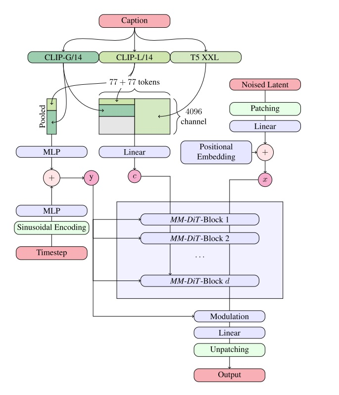
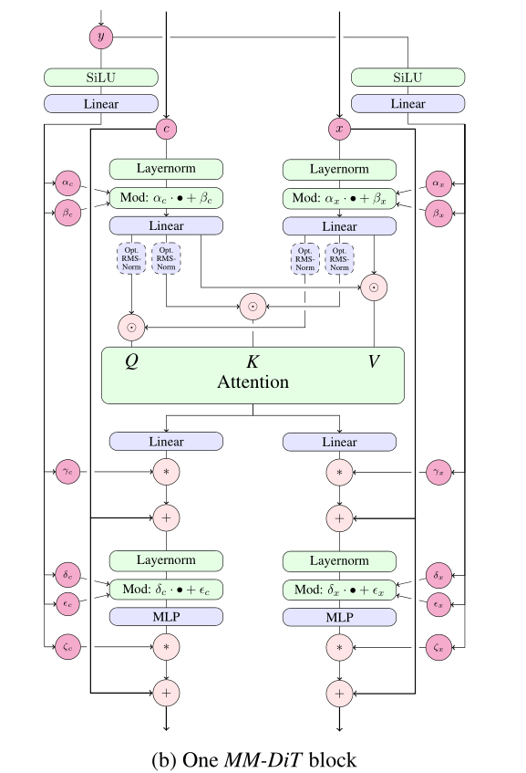

# Stable Diffusion 3 (SD3)

Stable Diffusion 3（SD3）是一种多模态扩散Transformer（MMDiT）文本生成图像模型，具有显著提升的图像质量、排版能力、复杂提示理解能力和资源效率。该模型能够根据文本提示生成高质量的图像。

与之前的版本相比，SD3 进行了以下两项重大改进：

1. **训练目标优化**：采用 改进的 Flow Matching(FM) 技术替代原先DDPM中的训练目标，提升了训练效果。
2. **去噪模型升级**：将去噪模型从U-Net更换为更适合处理多模态信息的MM-DiT，增强了模型的多模态处理能力。

PPDiffusers 针对 SD3 进行了全方位优化，实现了高性能推理加速，并支持多卡分布式推理。经测试，相比业界主流的 TensorRT 解决方案，性能提升达 25.9%。此外，PPDiffusers 还完成了对国产芯片的适配，为用户提供更灵活的部署选择。

## SD3 模型结构

Stable Diffusion 3 主要包含以下模块：

- text_encoder： 采用了三个文本编码器（CLIP-ViT/L、OpenCLIP-ViT/G 和 T5-xxl）

- transformer：核心网络由 UNet 换成了 MM-DiT
- scheduler：理论上采用了 Flow Matching 的技术，所以换成了 Flow Matching 的欧拉采样器
- vae：依然采用 VAE 将 image 编码到隐空间 latent

### Text Encoder模型

Stable Diffusion 3 (SD3) 的文本编码器（Text Encoder）在模型中扮演着至关重要的角色，它负责将文本提示转化为能够指导图像生成的语义表示。SD 3的文字渲染能力很强，同时遵循文本Prompts的图像生成一致性也非常好，这些能力**主要得益于SD 3采用了三个Text Encoder模型：**

1. CLIP ViT-L（参数量约124M）

2. OpenCLIP ViT-bigG（参数量约695M）

3. T5-XXL Encoder（参数量约4.76B）

   T5 是一个大型的语言模型，专为处理自然语言任务而设计。因此提供了细粒度的语义信息，有助于生成更加具体和详细的图像内容。

输入promt分别由这三个模型编码后，维度分别为：

| Prompt   | 文本编码器        | prompt_embed                    | pooled_prompt_embed |
| -------- | ----------------- | ------------------------------- | ------------------- |
| prompt   | CLIP ViT-L        | [B, 77, 768]                    | [B, 768]            |
| prompt_2 | OpenCLIP ViT-bigG | [B, 77, 1280]                   | [B, 1280]           |
| prompt_3 | T5 XXL            | [B, 256, 4096] 或 [B, 77, 4096] |                     |

SD3的文本编码过程可以分为两个主要阶段：**全局语义和细粒度语义**的提取。

- **全局语义（Pooled Text Embeddings）**：
  - CLIP ViT-L 和 OpenCLIP ViT-bigG 对输入文本进行编码，生成pooled_prompt_embeds，随后沿最后一个维度拼接形成 [B, 2048] 的张量，代表每个样本的全局语义特征。
- **细粒度语义（Text Embeddings）**：
  - 首先，CLIP ViT-L 和 OpenCLIP ViT-bigG 编码得到的 prompt_embeds 被沿最后一个维度拼接，形成 [B, 77, 2048] 的张量。
  - 然后，为了匹配 T5-XXL 的输出维度，上述张量通过填充零扩展至 [B, 77, 4096]。
  - 最后，这个扩展后的张量与 T5-XXL 编码的 prompt_embed 沿序列长度维度拼接，最终形成 [B, 333, 4096] 的张量，作为细粒度语义的表示。

### VAE 模型

在Stable Diffusion 3 (SD3) 中，变分自编码器**（Variational Auto-Encoder, VAE）**是连接文本和图像生成的重要桥梁。它不仅负责将原始图像压缩到一个较低维度的隐空间（latent space），还负责根据需要从这个隐空间重建图像。VAE在AI绘画中的作用已经超越了简单的生成能力，而更多地体现在对图像数据的**压缩和重建**上，这对于提高模型效率和生成质量至关重要。

#### 增加Latent通道数

在之前的Stable Diffusion系列中，VAE通常会将H×W×3的图像压缩成 $\frac{H}{8}\times\frac{W}{8}\times d$ 的latent特征，其中通道数d*d*一般设置为4。然而，这种配置存在一定的压缩损失，限制了图像细节的表现力。为了克服这一局限并提升重建效果，SD3引入了一些关键改进：将latent特征的通道数从原来的4个显著增加到了16个，减少了压缩过程中的信息丢失。

### MM-DiT 模型

MM-DiT（Multi-Modal Diffusion Transformer）是Stable Diffusion 3 (SD3) 中最显著的架构改进之一，它标志着AI绘画领域全面进入了Transformer时代。MM-DiT将去噪模型从传统的UNet架构转变为基于Transformer的多模态扩散模型，这不仅提高了图像生成的质量，还增强了文本和图像之间的交互能力。

#### DiT 的基础结构

在理解MM-DiT之前，先来回顾一下原始DiT（Diffusion Transformer）的基础结构：

如下图所示，**DiT**设计了和 **ViT** 模型 类似的Backbone主干网络，其全部由**Transformer Blocks**组成。

但与ViT不同的是，DiT作为扩散模型还需要在Backbone网络中嵌入**额外的条件信息**，这里的条件信息就包括了 Timesteps以及类别标签（文本信息）。

具体地，**DiT**提出了 **自适应 层归一化模块（Adaptive LayerNorm， AdaLN）**来引入这种额外的条件信息，其核心思想是根据输入的不同条件，自适应地调整 LayerNorm 中的缩放和偏移参数（$ \gamma,\beta$）。除此之外，在经过Self-Attention和FFN层后，激活值也会乘上一个由约束控制的缩放参数($\alpha$)。

#### MM-DiT的创新点

MM-DiT在继承DiT核心设计理念的基础上进行了扩展，以更好地处理文本和图像这两种不同模态的数据。

 MM-DiT 的子模块结构图如下所示。我们可以分几部分来看它。

- 先看全局约束 y 对应的分支，和标准 DiT 子模块一样， y 作为额外的条件信息控制 LayerNorm后的缩放和平移参数（$ \gamma,\beta$），包括后面的缩放参数($\alpha$)。

- 再来看文本信息 Text Embeddings 的嵌入方式，在之前的系列中的统一处理方式是在U-Net中使用**Cross-Attention**机制来与图像信息结合，其中Text Embeddings作为Attention中的keys和values。

  **而在MM-DiT中，Text Embeddings和图像的Patch Embeddings 分别经过Linear层得到Q、K、V之后，二者对应的Q、K、V会拼接到一起进行注意力操作，然后再将激活值拆分回到原本各自的分支。**这意味着文本和图像特征可以在共享的注意力空间中直接交互。

#### 总结

因为图像和文本属于两个不同的模态， SD3中 采用两套独立的权重参数来学习这两个不同模态的特征，所以只通过Self-Attention机制来实现特征的交互融合。**这也是SD 3论文称这个结构为MM-DiT的本质原因，这是一个多模态扩散模型。**

## Rectified Flow 

**SD 3不再使用DDPM作为扩散模型，而是该用优化的RF（Rectified Flow）做为扩散模型。**

**Rectified Flow技术**的核心思想是通过引入流变换方法，前向加噪过程被定义为一个Rectified Flow，以一条直线连接数据分布和噪声分布，简化模型的训练和推理过程，提升生成效率，具有比DDPM更好的理论属性和概念简洁性。

**关于会怎样影响diffusion model的损失函数**，原文中给了详尽的推导过程，补充材料中也给了严谨的数学证明，这里就不再一一赘述。

## 快速体验

想要快速体验 SD3 模型，可以参考以下推理示例：

- **文本生成图像**：[SD3 文本生成图像推理示例](https://github.com/PaddlePaddle/PaddleMIX/blob/develop/ppdiffusers/examples/inference/text_to_image_generation-stable_diffusion_3.py)
- **图像生成图像**：[SD3 图像生成图像推理示例](https://github.com/PaddlePaddle/PaddleMIX/blob/develop/ppdiffusers/examples/inference/image_to_image_text_guided_generation-stable_diffusion_3.py)

## 个性化微调

PPDiffusers 提供了 SD3 的个性化微调训练示例，仅需少量主题图像即可定制专属的 SD3 模型。支持以下微调方式：

- **DreamBooth LoRA 微调**
- **DreamBooth 全参数微调**

同时，支持在 NPU 硬件上进行训练。具体示例请参考：[DreamBooth 训练示例：Stable Diffusion 3 (SD3)](https://github.com/PaddlePaddle/PaddleMIX/blob/develop/ppdiffusers/examples/dreambooth/README_sd3.md)。

## 高性能推理

在推理方面，SD3 提供了高性能的推理实现，支持多卡并行推理。与竞品 TensorRT 相比，性能提升了 25.9%。具体内容请参考：[Stable Diffusion 3 高性能推理](https://github.com/PaddlePaddle/PaddleMIX/tree/develop/ppdiffusers/deploy/sd3)。

---

欢迎使用 Stable Diffusion 3，期待您的反馈与贡献！